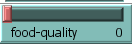
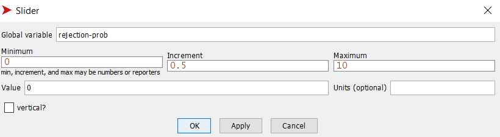
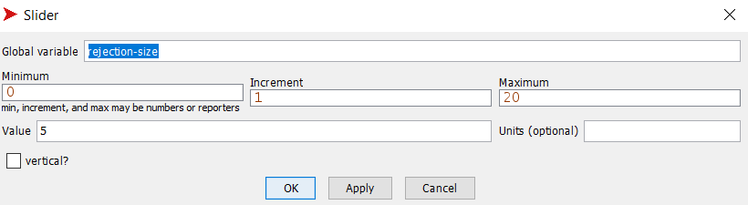
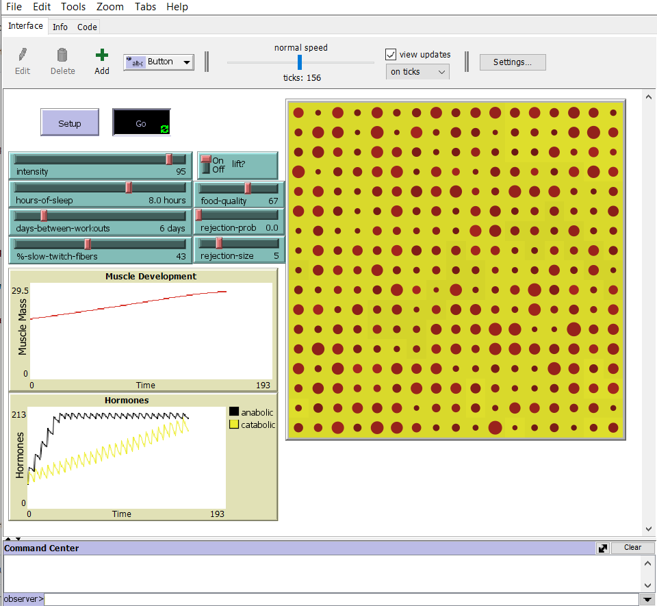
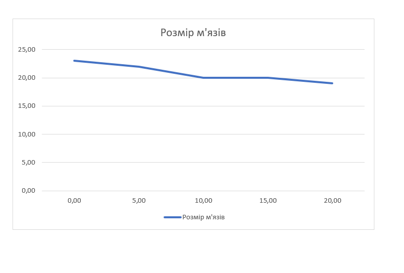

## Комп'ютерні системи імітаційного моделювання
## СПм-22-4, **Комаричев Андрій Валерійович**
### Лабораторна робота №**2**. Редагування імітаційних моделей у середовищі NetLogo

 

### Варіант 12, модель у середовищі NetLogo:
[Muscle Development](http://www.netlogoweb.org/launch#http://www.netlogoweb.org/assets/modelslib/Sample%20Models/Biology/Muscle%20Development.nlogo)

 

### Внесені зміни у вихідну логіку моделі, за варіантом:

**Додати у моделі вплив харчування (умовний регулюємий параметр, наприклад, "якість харчування") на можливість зростання м'язової маси.**

Додано слайдер, який дозволяє користувачеві змінювати якість харчування:

Додано процедуру eat. Порівнюється якість їжі з випадковим числом від 0 до 100. Якщо food-quality менше за це випадкове число, виконується перший блок коду, в якому зменшується кількіть анаболічних гормонів та росте кількість катаболічних. І в іншому випадку навпаки, що сприяє росту м'язів.
<pre>
 to eat
   ask muscle-fibers [
    ifelse food-quality < random-float 100 + food-quality / 10
    [
      set catabolic-hormone catabolic-hormone + food-quality / 15 * (log fiber-size 10)
      set anabolic-hormone anabolic-hormone - food-quality / 15 * (log fiber-size 10)
    ]
    [
      set catabolic-hormone catabolic-hormone - food-quality / 15 * (log fiber-size 10)
      set anabolic-hormone anabolic-hormone + food-quality / 15 * (log fiber-size 10)
    ]
  ]
end
</pre>

**Додати регулюємі користувачем параметри, що визначають вірогідність та міру тимчасового відхилення від вказаних початкових значень інтенсивності тренувань, кількості годин сну та днів між тренуваннями.**

Додано глобальні змінні
<pre>
  rejection?     ;; чи сталось відхилення
  rejection-time ;; час який буде діяти відхилення
  
  ;; змінні, щоб збергати значення інтенсивності тренувань, кількості годин сну та днів між тренуваннями до відхвилення
  intensity-temp
  hours-of-sleep-temp
  days-between-workouts-temp
</pre>

Додано нову процедуру reject, яка відповідає за відхилення початкових значень. Час який буде діяти відхилення 20 днів (20 тіків). 
<pre>
to reject
  if rejection-time + 20 < ticks [
    ifelse rejection-prob > random-float 100
       [set rejection? true
        set rejection-time ticks]
       [set rejection? false]
    
    ifelse rejection? 
    [
      set intensity (intensity - (intensity / 100 * rejection-size))
      set hours-of-sleep (hours-of-sleep - (hours-of-sleep / 100 * rejection-size))
      set days-between-workouts (days-between-workouts - (days-between-workouts / 100 * rejection-size))
      
    ]
    
    [
      set intensity intensity-temp 
      set hours-of-sleep hours-of-sleep-temp
      set days-between-workouts days-between-workouts-temp 
    ]
    
  ]
end
</pre>

Слайдери, які контролюють вірогідність та міру тимчасового відхилення

### Внесені зміни у вихідну логіку моделі, на власний розсуд:

**Додано окремим м'язовим волокнам унікальну для кожного волокна характеристику - швидкість зростання**

Змінено власні змінні м’язових волокон:
<pre>
 muscle-fibers-own [
  fiber-size   ;; different from built-in "size" because it uses different units
  max-size
  growth-rate
]
</pre>

Ініціалізація growth-rate для кожного м'язового волокна у межах від 0.9 до 1.1. Чим більше тим швидше ростуть м'язові волокна.
<pre>
 to new-muscle-fibers
 ***
      set growth-rate 0.9 + random-float 0.2
      regulate-muscle-fibers
    ]
  ]
 ***
end
</pre>

В процедуру new-muscle-fibers додано вплив індивідуального випадкового зростання для кожного м'язового волокна.
<pre>
 to new-muscle-fibers
  ask patches [
    sprout-muscle-fibers 1 [
      set max-size 4
      ;; create a normalized distribution of maximum muscle fiber sizes
      ;; with median dependent on % of slow twitch fibers.
      repeat 20  [
        if random-float 100 > %-slow-twitch-fibers [
          set max-size max-size + 1
        ]
      ]
      ;; provide non-uniform starting sizes for varied results, everyone's different
      set fiber-size (0.2 + random-float 0.4) * max-size
      set growth-rate 0.9 + random-float 0.2
      regulate-muscle-fibers
    ]
  ]
end
</pre>

Фінальний код моделі та її інтерфейс доступні за [посиланням](muscle.nlogo).
 

## Обчислювальні експерименти
### 1. Вплив міри тимчасового відхилення на зростання м'язів

Досліджується залежність росту м'язів протягом певної кількості тактів (200) від розміру міри тимчасового відхилення.
Експерименти проводяться при 0-20 розміру у відсотках міри тимчасового відхилення, з кроком 5, усього 5 симуляцій.  
Інші керуючі параметри мають значення за замовчуванням:
- **intensity**: 95
- **hours-of-sleep**: 8
- **lift**: on
- **days-between-workouts**: 5
- **%slow-twitch-fibers**: 50
- **rejection-prob**: 5
- **food-quality**:75%

<table>
<thead>
<tr><th>Міра тимчасового відхилення</th><th>Розмір м'язів</th></tr>
</thead>
<tbody>
<tr><td>0</td><td>23</td></tr>
<tr><td>5</td><td>22</td></tr>
<tr><td>10</td><td>22</td></tr>
<tr><td>15</td><td>20</td></tr>
<tr><td>20</td><td>19</td></tr>
</tbody>
</table>

Графік наочно показує, що із збільшенням міри тимчасового відхилення спостерігається зменшення розміру м'язів. Зокрема, при мірі відхилення 20 спостерігається найменший розмір м'язів у порівнянні з іншими варіантами.

 
